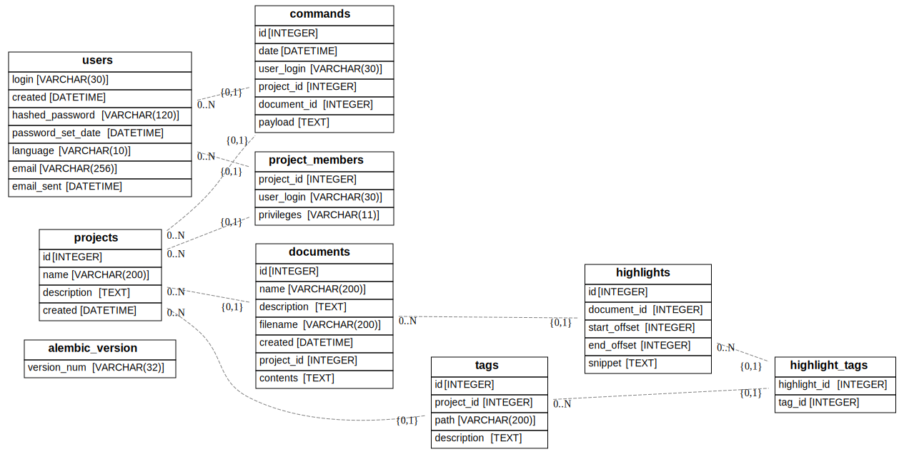

# Introduction

Taguette is a web-based Python application. It is meant to run both stand-alone on an end-user machine, where it must run automatically without having to configure databases or accounts; and as a service over the internet.

To learn more about Taguette, see the [Taguette Website](https://www.taguette.org/) and the [README](https://gitlab.com/remram44/taguette/blob/master/README.rst) in this repository. You can find general contributing instructions in [CONTRIBUTING.md](https://gitlab.com/remram44/taguette/blob/master/CONTRIBUTING.md).

# Architecture

## The server

A server, written in Python, handles most of the business logic. It is responsible for importing documents, adding tags and highlights, etc. This is the process you are starting when you run `taguette`.

We use Python 3.5+, the [Tornado web framework](https://www.tornadoweb.org/), [SQLAlchemy](https://www.sqlalchemy.org/), and [Jinja](https://jinja.palletsprojects.com/) to render HTML pages from templates (Tornado's built-in template language is quite limited).

On startup, the server asks the system to launch a web browser pointing to itself. The browser downloads "the frontend", HTML pages generated by the server (from templates), and receives requests sent from JavaScript code to the API to perform actions in a project. You can find the templates under `taguette/templates/` and the CSS and JavaScript files under `taguette/static/`.

## The database

The data is stored in a SQL database. Multiple database systems are supported (see [SQLAlchemy's documentation](https://docs.sqlalchemy.org/en/latest/core/engines.html)). SQLite3 is the default when running in single-user mode, PostgreSQL is used for [app.taguette.org](https://app.taguette.org/). MariaDB is tested and known to work. MySQL does NOT work (particularly the query used to merge tags).

[Alembic](https://alembic.sqlalchemy.org/) is used to migrate the database, which is to say apply changes to the data or the schema. If you upgrade your version of Taguette, it will read the version of the database from the table `alembic_version`, and apply migrations to take it to the latest version. This is done automatically in single-user mode (there is a warning in the terminal, and a backup of the SQLite3 file is made first), but in server mode, it will refuse to start and instruct you to use the `taguette migrate` command. You can find the migrations in `taguette/migrations/versions/`.

Highlights are represented by their position (`start_offset`, `end_offset`) in the document's text (skipping over HTML tags), counted in bytes in the UTF-8 text (see `taguette/extract.py`). The content of each highlight is stored in the `highlights` table, so we don't have to extract that part of the text from the `documents` table on each access.

## The frontend

The frontend consists of a few different views, rendered from Jinja templates. The most important one is the project view from which a user does all their work. The JavaScript is kept in a single file, `static/js/taguette.js`.

Every user action results in a call to the server over a JSON API. The server then syncs up every browser (including the acting user's) by sending an event over the long-polling endpoint; see [live editing](#live-editing) below.

# Live editing

To provide real-time collaboration between users, a web browser needs to be alerted of other users' changes immediately and update the view. To this end, each web browser maintains a long-lived connection to the server. Instead of replying to the web request immediately, the server keeps that request open until something happens and replies then. The frontend updates using that response and starts a new request. This is called [long-polling](https://en.wikipedia.org/wiki/Long_polling).

The events sent over this endpoint are the `commands` stored in the database. When a browser asks for new changes, it provides the ID of the last command it knows of. The server first checks the database, as there may already be changes to be sent (for example if the browser has been disconnected, the computer was asleep, or the browser tab was inactive) and otherwise waits in the long-polling fashion.

In practice, we also send those events to the browser that initiated those changes, so we don't have to have two separate mechanisms to update the view.

# Localization

Translation files are found in `po/`. The `.pot` files are generated from the code using [Babel](http://babel.pocoo.org/) (see `scripts/update_pot.sh`) and uploaded to [Transifex](https://www.transifex.com/remram44/taguette/) where users can help translate strings to their language. Those files are compiled to `.mo` files which are loaded by Tornado (see `scripts/update_translations.sh`).

By default, a user has no language set and Taguette will use the language preferences selected in the web browser's settings. Additionally, a user can select a language in their account settings, which will be used instead.

The translations are split between two catalogs `main` and `javascript`. The first one is for strings found throughout the server, for example in templates. The second one is for use in the frontend's JavaScript code; JavaScript downloads this catalog from the `/trans.js` endpoint, which gives a dictionary mapping English strings to their counterpart in the user's language.

# Conversion

When a document is added to a project, it first needs to be converted into a format suitable for viewing and highlighting.

The first step is to turn it into HTML. This is done by using [Calibre](https://calibre-ebook.com/)'s `ebook-convert` command. Calibre is run as a subprocess and given a 2-minute timeout (by default).

For old Microsoft Word 97 `.doc` files, `wvHtml` from the [wvWare package](http://wvware.sourceforge.net/)) is used instead.

The second step (unless the document was already HTML) is to sanitize this HTML to remove content that would not be safe or convenient to serve to users, such as scripts, media, etc. This is done using the [bleach](https://github.com/mozilla/bleach) library.

Finally, the document is inserted into the database.

In `taguette/convert.py` you will also find conversion functions going the other way, from HTML to other formats. Those are used when exporting data from Taguette.
