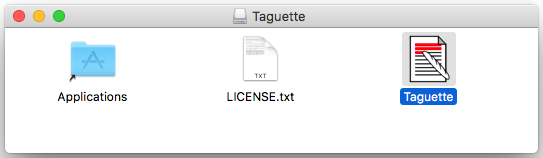
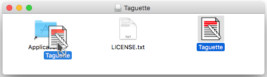
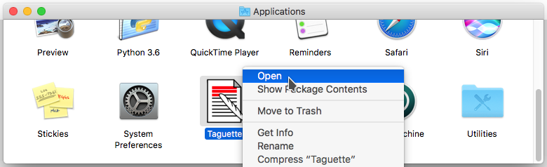
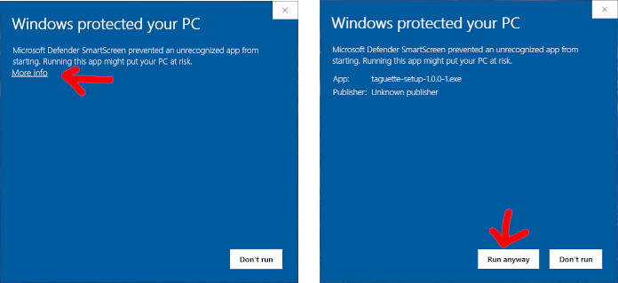

---
hide:
  - toc
---

# Install Taguette

Taguette is released under [the BSD license](https://gitlab.com/remram44/taguette/blob/master/LICENSE.txt). You can 
read about the team behind Taguette on our [About](about.md) page.

You are able to use Taguette on our server for free at [app.taguette.org](https://app.taguette.org) and also install Taguette locally on your 
computer and/or server (if you'd like to self-host!). Using Taguette on our server (or your own) means that you will be able to collaborate with others while using Taguette on your own computer means you can use it offline and by yourself.

Taguette works on macOS, Windows, and Linux. The installers for macOS and Windows include Python, Taguette, and Calibre, so you don't need to install anything else. For Linux, the easiest way to install Taguette is to use `pip`, and those instructions are below.

## macOS

1) Download the DMG file from our [latest release page](https://gitlab.com/remram44/taguette/-/releases/v1.4.1).



2) When you open it, you will see a Finder window. You should drag the "Taguette.app" file to the "Applications" folder.



3) Then double-click on "Applications", and right-click on "Taguette.app" and choose "Open". **You will only have to 
   do this the first time**. After this, you will be able to start Taguette from the Launchpad or Spotlight. Click 
   open when the security prompt comes up also.




Once you start the application, you will see a terminal window appear. This is normal! You can ignore it completely and use Taguette from your web browser ([`localhost:7465`](http://localhost:7465/) should open automatically). Simply leave the terminal window open until you are done using Taguette, after which you can close that terminal window to stop Taguette.

## Windows

1) Download the EXE file from our [latest release page](https://gitlab.com/remram44/taguette/-/releases/v1.4.1).

2) Open it. On some versions of Windows, you might get a warning that Taguette comes from an "unknown publisher". In that case, click on "more info" then "run anyway".



3. Click through the installer wizard's steps. A "Taguette" entry will appear in your Start Menu and on your Desktop, if you selected that option.

Once you start the application, you will see a terminal window appear. This is normal! You can ignore it completely and use Taguette from your web browser ([`localhost:7465`](http://localhost:7465/) should open automatically). Simply leave the terminal window open until you are done using Taguette, after which you can close that terminal window to stop Taguette.

## Linux

You first need to install the dependenices of Taguette: [Python 3](https://www.python.org/downloads/) and [Calibre](https://calibre-ebook.com/).

On Debian or Ubuntu, you can run this command in the terminal to install these dependencies: `sudo apt install python3 calibre`

Once you've installed the dependencies, you next create a Python 3 virtual environment and install Taguette with its dependencies from the terminal by using the following 3 commands:

```
python3 -m venv taguette.virtualenv
. taguette.virtualenv/bin/activate
pip install taguette
```

After this, use this command to start Taguette: `taguette.virtualenv/bin/taguette`

You'll see the command line will still be running. This is ok! Don't worry about the terminal, but do leave it open. A browser window should appear, pointing you to ([`localhost:7465`](http://localhost:7465/), and you can begin working on your projects!

## Development setup

You can also install from a local clone of this repository, which will allow you to easily change the sources to suit your needs:

1. Clone this git repository from the terminal: `git clone https://gitlab.com/remram44/taguette.git`
2. Navigate on the command line to the repository you've just cloned locally, using the cd command. To get help using cd, [use this tutorial](https://swcarpentry.github.io/shell-novice/02-filedir/index.html).
3. Taguette uses [Poetry](https://python-poetry.org/) for its packaging and dependency management. You will need to install Poetry: [https://python-poetry.org/docs/#installation](https://python-poetry.org/docs/#installation)
4. Install Taguette and its dependencies by running this command in the terminal: `poetry install`. Poetry will create a virtual environment for you by default, activate it by running poetry shell.
5. Build translation files by running this command in the terminal: `scripts/update_translations.sh`
6. You can start taguette in development mode by running this command in the terminal: `taguette --debug` (or 
   `taguette --debug server <config_file>`). This will start Tornado in debug mode, which means in particular that it will auto-restart every time you make changes.
7. Navigate to ([`localhost:7465`](http://localhost:7465/) to view Taguette!
